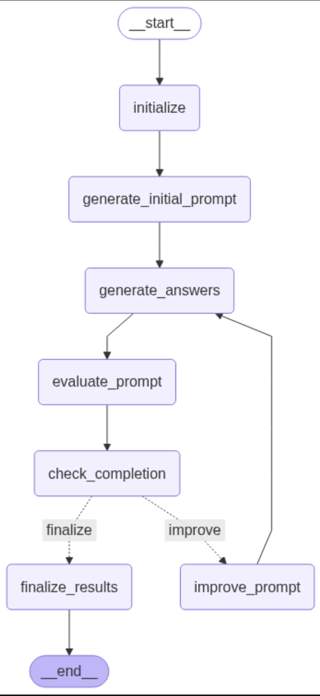
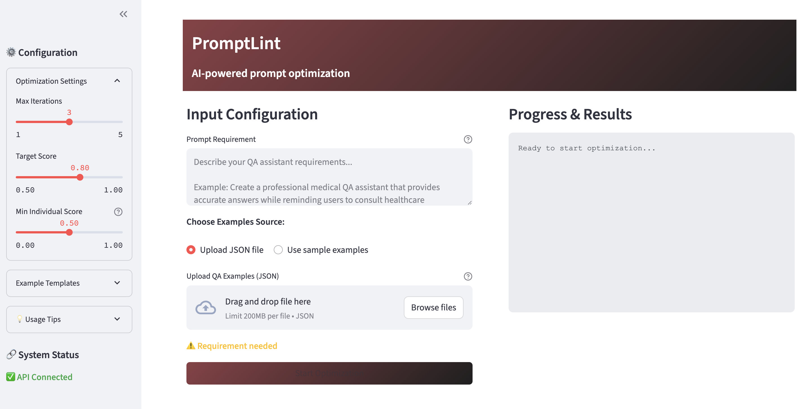

# 🔧 PromptLint

**AI-powered prompt optimization for production systems**

PromptLint is an advanced prompt optimization tool that uses LangGraph workflows and LLM-as-judge evaluation to iteratively improve prompts for any task. The system automatically optimizes prompts based on multiple quality metrics and provides real-time feedback through a professional Streamlit interface.

[](https://www.python.org/downloads/)
[](https://streamlit.io/)
[](https://github.com/langchain-ai/langgraph)

## 📋 Table of Contents

- [Features](#-features)
- [Architecture](#-architecture)
- [Workflow](#-workflow)
- [Installation](#-installation)
- [Quick Start](#-quick-start)
- [Usage](#-usage)
- [Configuration](#-configuration)
- [File Structure](#-file-structure)
- [Testing](#-testing)
- [Performance](#-performance)

## 🌟 Features

### **Core Functionality**
- **Automated Prompt Optimization**: Iterative improvement using LLM-as-judge evaluation
- **Multi-Model Architecture**: Separate models for generation, answer creation, and evaluation
- **Individual Metric Thresholds**: Prevents poor individual metrics from being averaged out
- **Real-time Progress Tracking**: Live updates during optimization process
- **Professional UI**: Clean, modern Streamlit interface with responsive design

### **Advanced Capabilities**
- **5-Metric Evaluation System**: Relevance, Accuracy, Completeness, Coherence, Format Match (customizable)
- **Flexible Input Sources**: Upload JSON files or use built-in example templates
- **Multiple Use Cases**: Question&Answering, Summarization tasks
- **Structured Output**: JSON export with detailed optimization history
- **Error Handling**: Robust error management with clear user feedback

## 🏗️ Architecture

PromptLint uses a three-LLM architecture designed for optimal performance and cost efficiency. While it currently defaults to specific models, users can easily modify the code to integrate any language model of their choice.

### **Three-Model System**
1. **Prompt Generation LLM** (Gemini 2.0-flash)
   - Creates and improves prompts
   - High creativity and reasoning capabilities

2. **Answer Generation LLM** (Ollama Granite3.3)
   - LLM to be used for final usecase
   - Generates answers for evaluation
   - Demonstrates visible improvement from optimization

3. **Evaluation LLM** (Gemini 2.5-flash)
   - LLM-as-judge for scoring answers
   - Consistent, objective evaluation
   - Detailed reasoning and feedback

### **Modular Architecture**
```
├── models.py             # Pydantic data models
├── core_components.py    # LLM interaction classes
├── workflow.py           # LangGraph orchestration
├── examples/             # Example datasets
├── helpers.py            # Utility functions
└── streamlit_app.py      # Web interface
```

## 🔄 Workflow

The optimization process follows a sophisticated multi-step workflow:



### **Detailed Process**

1. **Initialization**: Set up three LLM instances and validate configuration
2. **Initial Prompt Generation**: Create v1 prompt based on requirements and examples
3. **Answer Generation**: Use granite3.3 to generate answers for all test examples
4. **Multi-Metric Evaluation**: Score on 5 dimensions using Gemini as judge
5. **Completion Check**: Verify both overall score AND individual metric thresholds
6. **Iterative Improvement**: Generate improved prompts based on specific feedback
7. **Result Export**: Save optimized prompt with full evaluation history

## 🚀 Installation

### **Prerequisites**
- Python 3.11 or higher
- Ollama (for local model serving)
- Google API key (for Gemini models)

### **Setup Steps**

1. **Clone the repository**
   ```bash
   git clone <repository-url>
   cd PromptLint
   ```

2. **Create virtual environment**
   ```bash
   python -m venv penv
   source penv/bin/activate  # On Windows: penv\Scripts\activate
   ```

3. **Install dependencies**
   ```bash
   pip install -r requirements.txt
   ```

4. **Install Ollama and models**
   ```bash
   # Install Ollama (visit https://ollama.ai)
   ollama serve
   ollama pull granite3.3
   ```

5. **Set up environment variables**
   ```bash
   # Create .env file
   echo "GEMINI_KEY=your_google_api_key_here" > .env
   ```

## ⚡ Quick Start

### **Launch PromptLint**
```bash
source penv/bin/activate
streamlit run streamlit_app.py
```


### **Basic Usage**
1. **Configure Settings**: Adjust iterations, target score, and individual metric thresholds
2. **Input Requirements**: Describe your QA assistant needs
3. **Choose Examples**: Upload JSON file or select built-in templates
4. **Start Optimization**: Watch real-time progress and results
5. **Download Results**: Export optimized prompt as JSON

### **Example Configuration**
```python
# For summarization tasks
OptimizationConfig(
    max_iterations=3,
    target_score=0.8,
    min_individual_score=0.6,  # Stricter for format compliance
    generation_model_name="gemini-2.0-flash",
    answer_generation_model_name="granite3.3",
    evaluation_model_name="gemini-2.5-flash"
)
```

## 📖 Usage

### **Input Formats**

#### **JSON Example Structure**
Question can be left empty for non question answering use case.
```json
[
  {
    "question": "What is the capital of France?",
    "context": "France is a country in Western Europe...",
    "answer": "Paris"
  },
  {
    "question": "",
    "context": "Breaking news article content...",
    "answer": "{\"title\": \"Generated News Title\"}"
  }
]
```

#### **Requirements Specification**
```
Create a professional medical QA assistant that:
- Provides accurate, evidence-based answers
- Maintains appropriate medical disclaimers
- Uses clear, patient-friendly language
- Handles uncertainty with appropriate caveats
```

### **Built-in Example Types**

1. **General Knowledge**: Standard QA pairs for factual questions
2. **Medical QA**: Healthcare-focused questions with professional context
3. **Summarization**: Title generation and content summarization tasks

### **Configuration Options**

| Parameter | Description | Default | Range |
|-----------|-------------|---------|-------|
| Max Iterations | Maximum optimization loops | 3 | 1-5 |
| Target Score | Overall score threshold | 0.8 | 0.5-1.0 |
| Min Individual Score | Minimum per-metric threshold | 0.5 | 0.0-1.0 |
| Generation Temperature | Creativity for prompt generation | 0.7 | 0.0-2.0 |
| Answer Temperature | Creativity for answer generation | 0.7 | 0.0-2.0 |
| Evaluation Temperature | Consistency for evaluation | 0.1 | 0.0-2.0 |

## 🎯 Configuration

### **Individual Metric Thresholds**

PromptLint's key innovation is the dual-threshold system:

```python
# Problem: Poor format compliance hidden by high other scores
Relevance: 1.0, Accuracy: 1.0, Completeness: 0.9, Coherence: 0.9, Format: 0.3
Average: 0.82 ✅ (passes 0.8 threshold)
But Format: 0.3 ❌ (fails format expectations)

# Solution: Individual thresholds ensure ALL metrics meet standards
✅ Overall: 0.82 >= 0.8 (target_score)
❌ Format: 0.3 < 0.5 (min_individual_score)
→ Continue optimization to fix format issues
```
These metrics are customizable by making changes to the prompt.

## 📁 File Structure

```
PromptLint/
├── README.md                      # This file
├── requirements.txt               # Python dependencies
├── .env                           # Environment variables locally
├── .gitignore                     # Git ignore rules
│
├── models.py                      # Pydantic data models
├── core_components.py             # LLM interaction classes
├── workflow.py                    # LangGraph workflow
├── helpers.py                     # Utility functions
├── streamlit_app.py               # Main web interface
│
├── examples/                      # Example datasets
│   ├── __init__.py
│   ├── examples_normal.py         # General knowledge QA
│   ├── examples_medical.py        # Medical domain QA
│   └── examples_summarization.py  # News summarization
│
├── results/                       # Optimization outputs
    └── .gitkeep

```


## 🧪 Testing

### **Run Tests**
```bash
# Test all imports
python -c "from models import *; from workflow import *; print('✅ All imports successful')"

# Test configuration
python -c "from models import OptimizationConfig; print(OptimizationConfig())"

# Test UI compilation
python -m py_compile streamlit_app.py
```

### **Manual Testing**
1. Start the application: `streamlit run streamlit_app.py`
2. Use the summarization examples with low individual thresholds
3. Verify that format matching failures trigger continued optimization
4. Check that all metrics are displayed in the progress log

## 📈 Performance

- **Initialization**: ~5 seconds
- **Per Iteration**: 30-60 seconds (depends on model response times)
- **Complete Optimization**: 2-5 minutes for 3 iterations
- **Memory Usage**: ~200-500 MB

---
